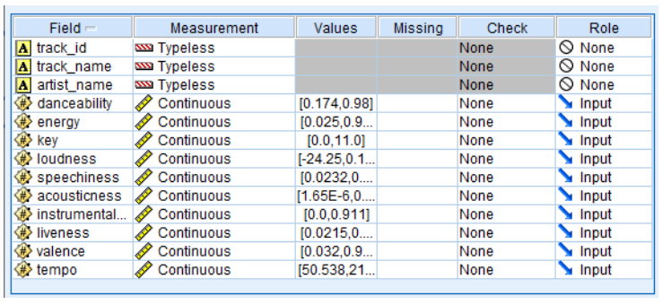
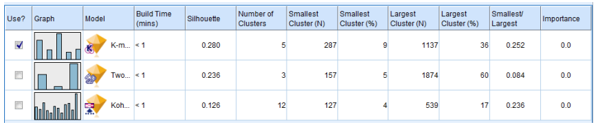
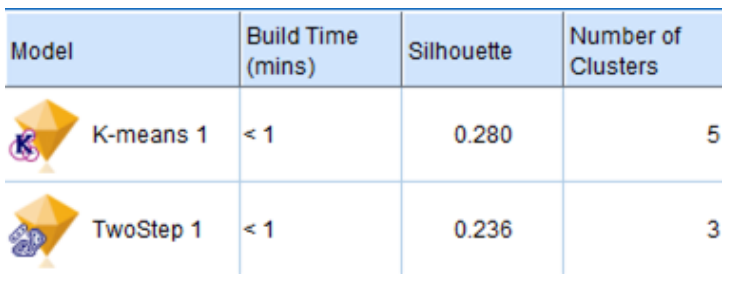
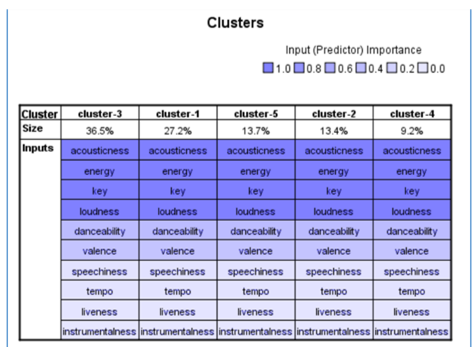

# SpotAI
It is a recommendation system utilizing K-means algorithm with Spotify API using the dataset from Kaggle courtesy from JC Peralta ([Kaggle dataset](https://www.kaggle.com/datasets/jcacperalta/spotify-daily-top-200-ph)). 

## Setup
1. Setup a Spotify account and a Spotify [Developer](https://developer.spotify.com) Account
2. Create an app on Spotify Developer Dashboard, set the Redirect URIs to http://127.0.0.1:8080/
3. Get the *SPOTIFY_CLIENT_ID* and *SPOTIFY_CLIENT_SECRET* of the created app, input these to .env
4. Run the Main.py
5. Click "Start" button.
6. Choose to either of the options: **Choose from 3 attributes to create a playlist** and **Provide playlist link to match your preferences with the playlist**.
7. Get your profile link from your Spotify account by clicking on the **Copy link to profile**.
8. After submitting, the process may take 3-5 minutes. There will be 2 or 3 playlist will be created in your playlist list titled based from the Attributes.

> Warning: Some playlist may cause the system to crash. The system may crash if the given playlist has less or exceeds 150 songs.

# Figures for determining the algorithm to be used based from the accuracy results
>  
    This figure describes the model which will utilize the data from the evaluation metric for the number of clusters and the clean data. the columns were divided as follows: field of attributes of the songs, measurement level (continuous and nominal), value for each field, and its role (input or target).  The Input field will be the role of each predictor variable, whose values will be utilized by the modeling method.
>  
    This figure displays the result based from running the data in IBM SPSS Modeler which shows that K-means, and TwoStep were the top recommended models to be used for the data. This table  displays the recommended number of clusters and the score of it based on silhouette coefficient.
>  
    This figure displays silhouette represented the analyses' score based on the number of clusters provided.
>  
    This figure shows the predictor importance which indicates the significance of each predictor in algorithms. The predictors of K-means and TwoStep, as shown in the figure rank the predictors from most important to least essential. Acousticity, energy, key, and loudness are the most important in K-means, whereas speechiness, pace, liveness, and instrumentalness are the least important.
